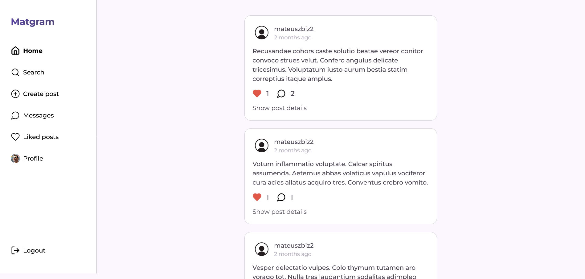
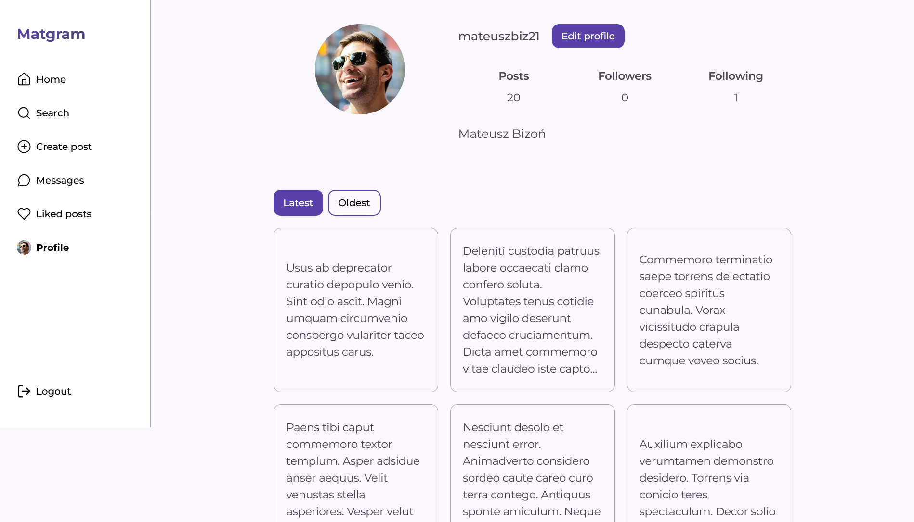
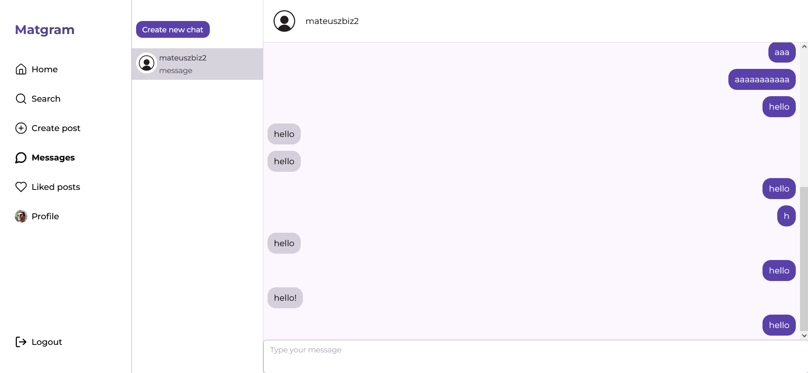
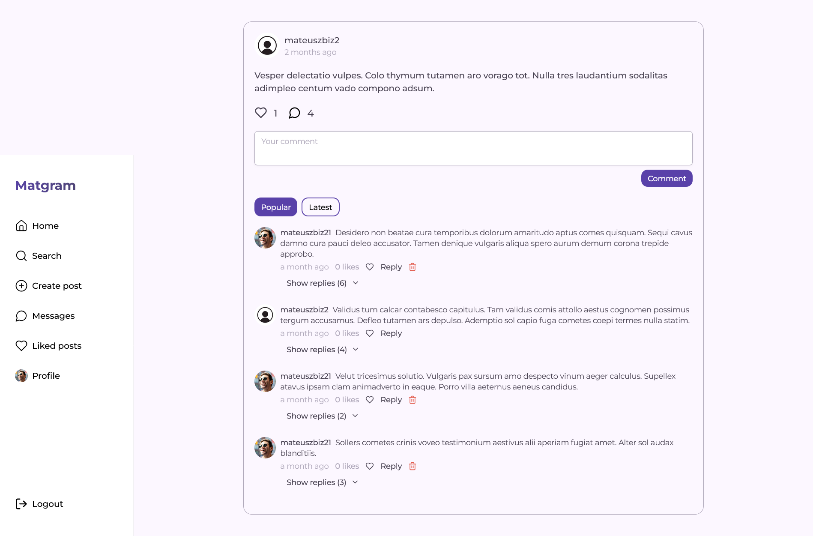
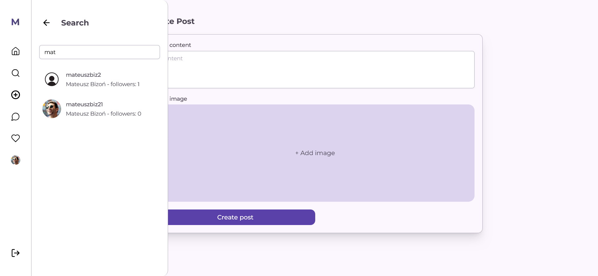

# Matgram - Social Media Application

Implemented web application for social media. The main goal for this project was to create social media with it's main functionalities like posts, user profiles, liking, comments and real-time chats.

This is only front-end project. For back-end [click](https://github.com/mateuszbizon/social_media_backend) here.

## Tech stack

### Front-end

- HTML5
- CSS3
- Next.js
- TailwindCSS
- React Query
- Zustand
- Shadcn
- Socket.io
- Axios
- Zod

### Back-end

- Express.js
- Prisma
- PostgreSql
- Socket.io
- Cloudinary
- Zod

## Screenshots

